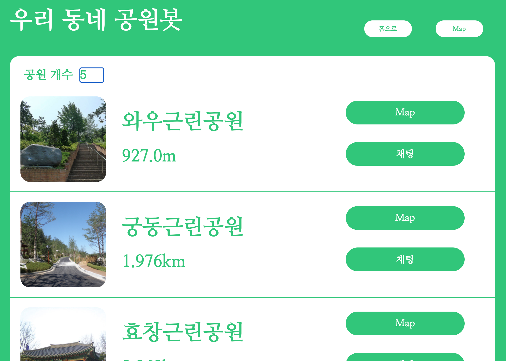
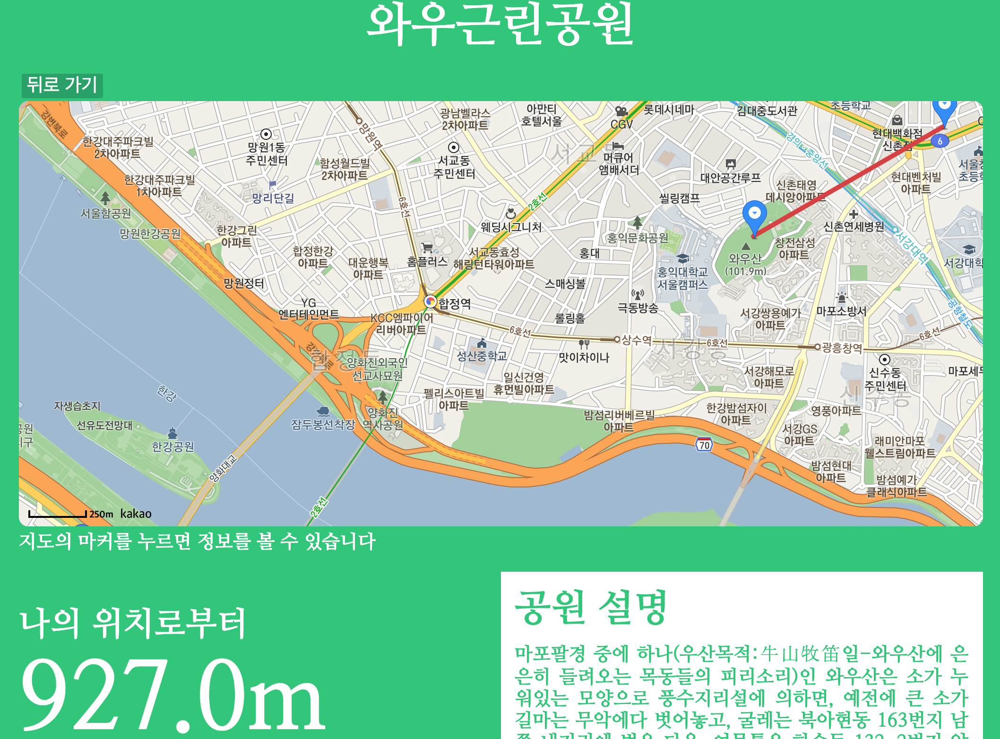

# Mobile-Mash-Up: 2021-1 인터넷 프로그래밍 프로젝트

## Run Application on Local Environment

### 1. Create Virtual Environment

```
conda create -n parksns python=3.7
```

### 2. Install Libs

```
conda activate parksns
pip install -r requirements.txt
```

### 3. Run App

```
# open your Redis server(use another command if your os doesn't belong to UNIX family)
redis-server &
conda activate parksns
cd parksns
python manage.py runserver
```

## 우리 동네 공원봇
### 실행 화면






